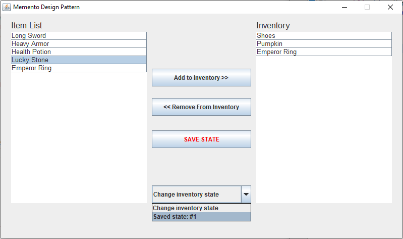
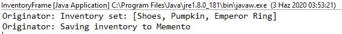

# Behavioral Patterns

## 1.1. Memento Pattern

Memento Tasarım Deseni, geri alınabilir eylemlerin implement edilebilmesi için bir çözüm sunmaktadır.

* Bir nesnenin önceki durumlarını saklamak/depolamak amacıyla kullanılır.

* İmplementasyon detayını açığa çıkarmadan nesnenin durumunun kaydedilmesi ve yüklenmesine imkan tanır.

### Senaryo

Günümüz dünyasında son kullanıcılar, her türlü arayüz ve uygulamada geri alma ya da bir önceki duruma dönme seçeneklerini talep etmektedir. Bir nesnenin gerektiğinde yedeğinin alınabilmesi, kullanıcı deneyimi açısından oldukça önemlidir.

Bir MMORPG oyunundaki karakterin sahip olduğu envanteri düşünelim.

* Oyuncu envanteri önemlidir. Belirli aralıklarla bir yedeği alınır, kopyalanır.

* Eğer oyun içerisinde bir **roll-back işlemi gerekirse,** tüm oyuncuların** belirli tarihteki kopya envanterleri** oyuna yüklenir.

### Problem

* Durumu kaydedilecek nesneye `Originator` denmektedir.
* Nesnenin tüm kaydedilen durumları `CareTaker` içerisinde tutulur.
* İlgili nesnenin her bir kopyasına `Memento` adı verilir.

* `Memento` nesnesi, `CareTaker` sınıfına mümkün olduğunca az bilgi açığa çıkarmalıdır.
** **Kapsülleme prensiplerinin** çiğnenmemesi adına, *Originator sınıfının yapısı* dışarıdan erişilir ve kopyalanabilir halde tutulmamalıdır.

### Çözüm

* Durumu kopyalanacak `Originator` nesnesi, kendisini kopyalar.
** Kapsülleme prensipleri gözetilir. Nesnenin dışarıdan erişim suretiyle kopyalamasının önüne geçilir.

* Pattern, kopya nesne durumunun `Memento` adı verilen özel bir nesnede tutulmasını önerir.

* Üretilen tüm kopya nesneler (Memento nesneleri), Caretaker nesnesi içerisinde tutulur.

.Memento tasarım kalıbı UML şeması
[uml,file="memento_uml.png"]
--
@startuml
left to right direction

class JFrame {
}

class InventoryFrame {
    -JPanel contentPane
    -JTable tableItemList
    -JTable tableInventory
    -JButton buttonBuy
    -JButton buttonSell
    -JButton buttonSaveState
    -JCombobox comboMemento
    -int inventoryStateCount
    +{static} void main(String[])
    +InventoryFrame()
}

class CareTaker {
    -List<Memento> mementoList
    +void addMemento(Memento)
    +Memento getMemento(int)
    +List<Memento> getMementoList()
}

class Originator {
    -List<String> inventory
    +Originator()
    +List<String> getInventory
    +void setInventory(List<String>)
    +Memento saveStateToMemento
    +List<String> getStateFromMemento(Memento)
}

class Memento {
    -List<String> inventory
    +Memento(List<String>)
    List<String> getInventory()
}

InventoryFrame --|> JFrame
InventoryFrame --> "caretaker" CareTaker : kullanır
InventoryFrame --> "originator" Originator : kullanır

CareTaker --> Memento
Originator --> Memento

@enduml
--

.Originator.java
[source,java]
....
public class Originator {	
	private List<String> inventory = new ArrayList<>();

	public List<String> getInventory() {
		return inventory;
	}

	public void setInventory(List<String> inventory) { <1>
		System.out.println("Originator: Inventory set: " + inventory.toString());
		this.inventory = inventory;
	}
	
	public Memento saveStateToMemento() { <2>
		System.out.println("Originator: Saving inventory to Memento");
		return new Memento(inventory);
	}
	
	public List<String> getStateFromMemento(Memento memento) {<3>
		inventory = memento.getInventory();
		System.out.println("Originator: Previously saved inventory of user :" + inventory.toString());
		
		return inventory;
	}
}
....
<1> Memento olarak kaydedilecek kendi nesnesini set eder.
<2> Yeni bir Memento oluşturup anlık envanteri ilgili Memento nesnesine atar.
<3> İlgili mementodan envanter bilgisini alır.

.Memento.java
[source,java]
....
public class Memento {	
	private List<String> inventory = new ArrayList<>(); <1>
	
	public Memento(List<String> inventory) {
		this.inventory = inventory;
	}
	// getter and setters...
}
....
<1> Originator nesnesinin ilgili kopyası, Memento nesnesinde tutulacaktır.

.CareTaker.java
[source,java]
....
public class CareTaker {	
	private List<Memento> mementoList = new ArrayList<Memento>(); <1>
	
	public void addMemento(Memento inventory) {
		mementoList.add(inventory);
	}
    // getters and setters...
}
....
<1> Tüm ilgili yedek nesneler, CareTaker sınıfı içerisindeki Memento listesinde tutulur.

### Uygulama

* Uygulama arayüzünde bir eşya listesi ve kullanıcı envanteri tasvir edilmiştir.
* Kullanıcı listeden envantere eşya ekleyebilmekte ve envanterinden eşya silebilmektedir.
* İlgili değişikliklerden sonra *SAVE STATE* butonu ile *kullanıcı envanter durumu kaydedilir.*
** Kaydedilen her state, Combobox'ta listelenmektedir.
** İlgili kayda basılmak suretiyle hafızaya alınan envanter dizilimine erişilebilir.

#### Save butonu ve Memento nesnesinin oluşturulması

.InventoryFrame.java
[source,java]
....
btnSaveState.addActionListener(new ActionListener() {
	public void actionPerformed(ActionEvent e) {
		// save state for inventory
		
		// get current inventory items...
		List<String> inventoryList = new ArrayList<String>();
		
		// Set the value for the current memento
		originator.setInventory(inventoryList); <1>
		
		// Add new items the ArrayList
		caretaker.addMemento(originator.saveStateToMemento()); <2>

		currentInventory++;
		
		comboMemento.addItem("Saved state: #" + currentInventory); <3>
	}
});
....
<1> Kopyalanacak envanter, set edilir.
<2> Originator tarafından Memento nesnesi oluşturularak envanter kaydedilir. Ardından CareTaker içerisinde tutulan Memento listesine eklenir.
<3> İlgili kopya envanter kaydı, roll-back işlemi için combobox'a eklenir.

İlgili çıktı aşağıda verilmiştir.

#### Nesnenin önceki duruma döndürülmesi, roll-back işlemi

.InventoryFrame.java
[source,java]
....
comboMemento.addActionListener(new ActionListener() {
	public void actionPerformed(ActionEvent e) {
		int stateNumber = Integer.parseInt(selectedCombo.replaceAll("[\\D]", ""));
		
		List<String> inventoryList = originator.getStateFromMemento( caretaker.getMemento(--stateNumber) ); <1>
		
	}
});
....
<1> Listeye eklenen numarası kullanılarak caretaker nesnesinden ilgili memento kaydı alınır.

Kodun çıktısı aşağıda verilmiştir:

----
Originator: Previously saved inventory of user :[Shoes, Pumpkin, Emperor Ring]
----